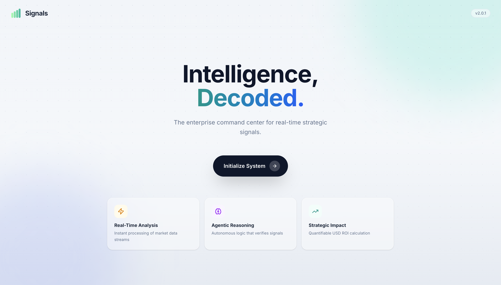
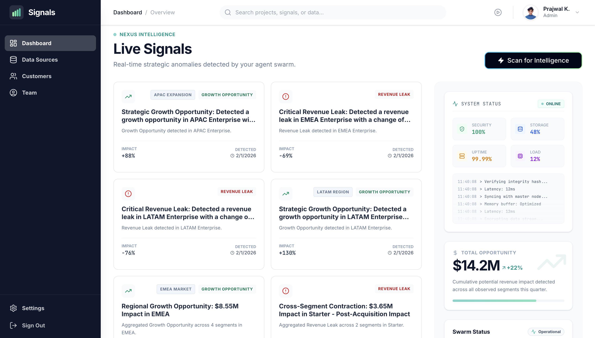
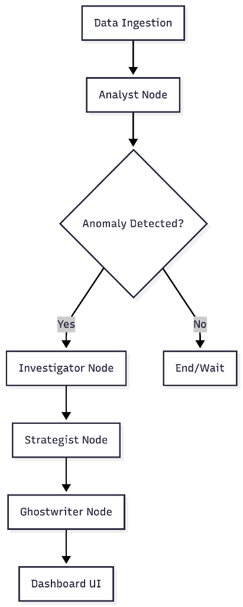

# Signals: Proactive Transformation Intelligence

**Signals** is a high-stakes executive command center that shifts the enterprise from reactive reporting to proactive intervention. Powered by the **Nexus Swarm**—a stateful multi-agent orchestration—it identifies revenue leaks, operational bottlenecks, and growth opportunities in real-time.




---

## 💎 The Value Proposition
Traditional BI tells you *what* happened last quarter. **Signals** tells you *why* it's happening right now and *how* to fix it. 

By synthesizing structured financial data with unstructured human context (Slack, Email, Memos), Signals bridges the **"Incentive Gap"** in AI transformation. It doesn't just find problems; it identifies **Employee Champions**—the internal innovators already working on solutions—and provides an ROI-backed roadmap for the CEO to approve builds instantly.

---

## 🧠 The Nexus Swarm (Architecture)
Built on **LangGraph**, our system uses a stateful, multi-agent "Swarm" to ensure deterministic outcomes and audit-ready math.



1. **🕵️ Analyst Agent ("The Quant")**: Uses a **Python Code Interpreter** to execute rigorous statistical analysis on raw CSV data. It finds the "Truth" in the numbers.
2. **🔍 Investigator Agent ("The Insider")**: Performs semantic RAG across internal context silos. It discovers the **"Why"** and attributes innovation to specific employees.
3. **♟️ Strategist Agent ("The Architect")**: Calculates **Risk-Adjusted ROI** using a deterministic math engine and Tavily-powered market research.
4. **✍️ Ghostwriter Agent ("The Chief of Staff")**: Synthesizes a Tier-1 consulting-style executive brief, collapsing multiple data points into a single "Master Signal."

---

## 🛠️ Tech Stack & Trade-offs

### Why this Stack?
- **LangGraph over Linear Chains**: We chose LangGraph to manage complex state transitions. This allows our agents to "hand off" specific context (like row numbers and employee names) without data loss or hallucinations.
- **Python REPL for Math**: We don't trust LLMs with arithmetic. The Analyst writes and executes transient Python code to ensure all percentages and USD impacts are 100% accurate.
- **Glassmorphism UI**: Designed for the "Time-Poor Executive," focusing on high-density data and clear call-to-actions.

---

## 📊 Data Narrative
Signals uses three distinct data modalities to simulate a real-world enterprise:
- **`sales_2025.csv`**: 1,000+ rows of transactional revenue data.
- **`internal_context.txt`**: A messy dump of Slack, Jira, and Email logs to be filtered and attributed.
- **`transformation_backlog.json`**: A library of strategic initiatives mapped to real-world pain points.

---

## 📂 Project Structure
```bash
signals/
├── backend/                # FastAPI + LangGraph Agent Server
│   ├── agents/             # The "Swarm" (Analyst, Investigator, Strategist...)
│   ├── graph.py            # Stateful workflow orchestration
│   └── storage.py          # Persistent JSON "Signals Vault" logic
├── frontend/               # Next.js 15 Command Center
├── data/                   # The "Synthetic Truth" dataset
└── README.md
```

---
## ☁️ Deployment

### Backend (AWS Lightsail)
The backend is dockerized and acts as a stateless API agent service.
```bash
docker build --platform linux/amd64 -f backend/Dockerfile -t signals-backend .
aws lightsail push-container-image ...
```

### Frontend (Vercel)
The frontend is a static/serverless Next.js app optimized for Vercel deployment.
-   Connect GitHub Repo
-   Set `NEXT_PUBLIC_API_URL` to your Lightsail endpoint.

---
## 🔮 Roadmap
-   [x] **mvp**: Single-player agent loop
-   [x] **ui**: Glassmorphic "Minority Report" interface
-   [x] **deploy**: AWS + Vercel pipeline
-   [ ] **scale**: Real-time WebSocket streaming
-   [ ] **collab**: Multi-user workspaces

---
© 2026 NexusFlow Inc. | Built for the Tenex Build First Application.